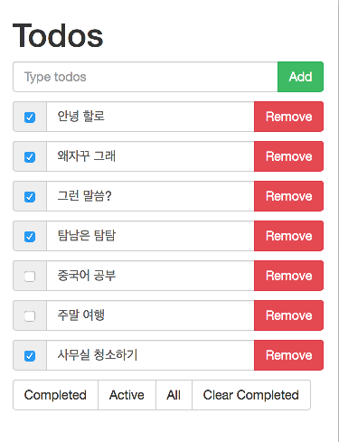

todomvc-angular
===============

## 강의 목차


### 우리가 만들 Todo 앱 미리보기



* 서버에 저장된 Todo 목록을 웹페이지에 보여줌
* 기존 Todo 의 내용, 삭제, 완료 처리할 수 있음
* 새로운 Todo를 입력하면 기존 투두에 추가됨
* Todo 상태에 따라 complteded, acitve로 필터링 할 수 있음
* 완료된 Todo 들은 목록에서 제거할 수 있음


### 프로젝트 구조

* 서버는 Node.js기반의 Express.js 웹프레임웍을 사용함
* 서버는 1) html, css, javascript 등의 정적 파일을 제공하고 2) ajax 기능을 수행할 api를 제공함  
* 웹페이지는 Angular.js를 사용한 하나의 페이지(index.html )로 구성됨
* 앵귤러 컨트롤러로 웹페이지를 조작하고 앵귤러 서비스를 통해 백엔드 api와 통신함


### Nodejs

Install: [https://nodejs.org/en/](https://nodejs.org/en/)

```
$ node --version
$ which node
```

### Npm

npm을 이용하여 개발 진행

* angularjs등 외부 라이브러리를 설치하고
* 노드 서버를 구동할 수 있음


설치:

```
$ npm --version
$ which npm
```

npm으로 프로젝트 생성:

```
$ npm init
```


### index.html

```
$ touch index.html
```


### Angular Setting

Angular.js 설치

```
$ npm install angular --save
```

index.html에 angular.js 로딩

```html
<html ng-app="todomvc">
  <!--  여기서 부터는 todomvc라는 앵귤러 모듈 영역임 -->
</html>
```


### Controller

TodomvcCtrl.js:

```javascript
angular.module('todomvc')
    .controller('TodomvcCtrl', function ($scope) {
      $scope.message = 'Hello world!';
    });
```

$scope 변수의 역할:

* 템플릿과 컨트롤러간의 데이터 연결


index.html:

```html
<body ng-controller="TodomvcCtrl">
  <p>
    {{ message }} <!-- "Hello world!" -->
  </p>
</body>

```


### Service

todomvcStorage.js

```javascript
angular.module('todomvc')
    .facgtory('todomvcStorage', function () {
      var storage = {
        // ...
      }

      return storage;
    });
```

서비스의 역할:

* 데이터 저장소의 역할
* 백엔드가 연결되면 api를 활용하여 서버 데이터를 핸들링하는 역할


### Stylesheet

[https://github.com/twbs/bootstrap](https://github.com/twbs/bootstrap)

npm으로 부트스트랩 설치:

```
$ npm install bootstrap@3 --save
```

index.html에 스타일시트 로딩:

```html
<link rel="stylesheet" href="node_modules/bootstrap/dist/css/bootstrap.css">
```


### Directive

index.html:

```html
<todo-item todo="todo" remove="remove(todo)"></todo-item>
```


### Express.js

서버 기능

* 웹페이지 호스팅
* 데이터베이스


```
$ npm isntall expressjs --save
```

sample code: [http://expressjs.com/en/starter/hello-world.html](http://expressjs.com/en/starter/hello-world.html)

```
$ node server/app.js
```

### Web hosting

```javascript
app.use(express.static(path.join(__dirname, '../client')));
app.use('/node_modules', express.static(path.join(__dirname, '../node_modules')));
```


### REST API

GET /todos

DELETE /todos/:id

POST /todos: bodyParser 필요함

PUT /todos/:id


### Postman

install [link]()


### Ajax

$http


### Router

### Homework

unit test
